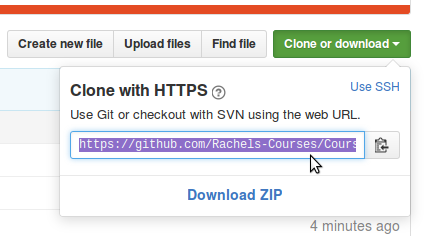

# Introduction to Source Control - Command Line

## Introduction

In the other document, we go over creating a GitHub account, creating repositories, and uploading files.

The proper way to use Git is from a software program that will bring down your code directly on your computer. 
You can do this from the command line, and there is a set of a few commands you will need to be familiar with
to the basic functionality.

## Setup

From the command line, you will want to set up a few things in git, so that
your commits have your name and email.

	git config --global user.name "John Doe"
	git config --global user.email johndoe@example.com

## Git commands

### git clone

In order to bring the code off of the GitHub server and onto your machine,
you first need to call **git clone**.

First, from the web, open your repository and click the **Clone or download**.

There will be a URL listed in here. Highlight and copy it.

On your computer, you need to open the command prompt.

* From Windows, navigate to a folder in the File Explorer, then hold down SHIFT while right-clicking. "Open command window here" will be an option.

From the command line, type in:

	git clone URL
	
where you will paste in the URL from your repository. Hit ENTER and
Git will automatically bring down all the files.

### git add

Once you've made changes to one or more files, you will have to add it
before making a commit. To add all files, you can use:

	git add .
	
or to add one specific file, use:

	git add FILENAME
	
### git status

You can use this command to see what files have been changed, and
which ones are ready to be added to the commit. The command is just:

	git status

### git commit

A commit is essentially like making a snapshot in time of your changes.
After you've added some files, you will then commit them.

Commits require a description, so you can do this all in one step with:

	git commit -m "description of changes made"

If you use just "git commit" by itself, it will open up a text editor for you
to edit your commit message in.

### git push

After you've made one or more commit, you can then push your changes to the server.
You can do this:

	git push -u origin master

and your changes will then show up on the web interface.

### git pull

If you've been working from multiple machines, and the repository is cloned
on several machines, you might need to pull the latest changes. You can do this with:

	git pull
	
## Standard usage

### 1. You've made some changes and want to upload them to the server:

	git add .
	git commit -m "description"
	git push -u origin master
	
Note that you can make multiple commits first, and then push them all
to the server at the same time.
	
### 2. Pulling down changes

Before you pull changes from the repository, you should commit any pending changes.

	git add .
	git commit -m "wip changes"
	git pull
	
then, it may merge the changes

